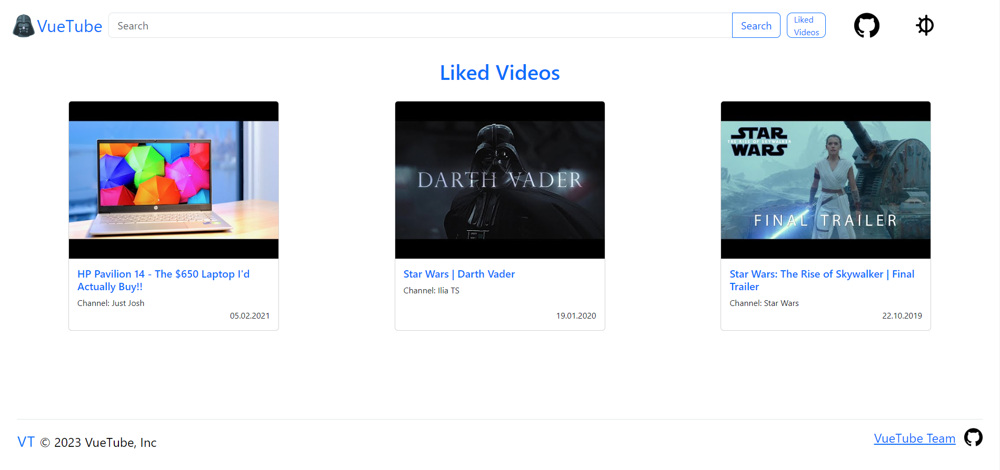

<br/>
<p align="center">
  <a href="https://github.com/stojchevskiboris/vuetube">
    
  </a>

  <h3 align="center">Vuetube - Alternative YouTube FrontEnd</h3>

  <p align="center">
    Search and watch videos without ads.
    <br/>
    <br/>
    <a href="https://vuejs.org/"><strong>Explore the docs »</strong></a>
    <br/>
    <br/>
    <a href="https://vuetube-t7xj.onrender.com/"><strong>Try VueTube »</strong></a>
  </p>
</p>

 

## About The Project
<h1>Screen 1</h1>

<kbd>

</kbd>
<br><br><br>

<h1>Screen 2</h1>
<kbd>

</kbd>
<br><br><br>

<h1>Screen 3</h1>

<kbd>

</kbd>

## Built With

This project was built with <a href='https://vuejs.org/'>Vue Framework</a>, based on <a href='https://devdocs.io/javascript/'>JavaScript</a>.
Also using in project:
<ul>
  <li><a href='https://getbootstrap.com/'>Bootstrap</a></li>
  <li><a href='https://jquery.com/'>jQuery</a></li>
</ul>

## Getting Started


### Installation
Clone the repo

```sh
git clone https://github.com/stojchevskiboris/vuetube.git
```


## Customize configuration

See [Vue Configuration Reference](https://vuejs.org/).

## Project Setup

```sh
npm install
```

### Compile and Hot-Reload for Development

```sh
npm run dev
```

### Compile and Minify for Production

```sh
npm run build
```


## Contributors

* **Boris Stojchevski** - [GitHub](https://github.com/stojchevskiboris/) 
* **Krste Gosharevski** - [GitHub](https://github.com/krstegosharevski/)
* **Dushan Temelkovski** - [GitHub](https://github.com/DusanTemelkovski/)
